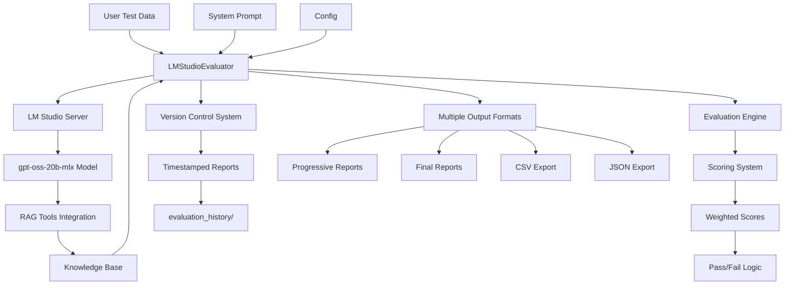

# LM Studio Evaluator with RAG

A comprehensive evaluation system that uses LM Studio server with RAG (Retrieval-Augmented Generation) to evaluate model outputs against expected results.

## 🌟 **Key Features**

- ✅ **LM Studio Integration** - Connects to local LM Studio server
- ✅ **RAG Verification** - Uses knowledge base for fact-checking
- ✅ **Order/Sequence Checking** - Validates correct ordering in lists and steps
- ✅ **Detailed Scoring** - 5 metrics with 1-10 scale (Factual Accuracy, Completeness, Order, Relevance, Quality)
- ✅ **Professional Table Output** - Clean, organized results display
- ✅ **Multiple Export Formats** - JSON and CSV outputs
- ✅ **Three-Document Architecture** - Clean separation of system prompt, test data, and knowledge base

## 🏗️ **System Architecture**

### **Core Components**



### **Data Flow Architecture**

1. **📥 Input Processing**
   - Parse `user_test_data.txt` into `TestCase` objects
   - Each test case contains multiple `TestRun` instances
   - Load system prompt and knowledge base

2. **🔄 Evaluation Pipeline**
   ```
   TestCase → TestRun → LM Studio API → RAG Verification → Scoring → Results
   ```

3. **🧮 Scoring System**
   - **Weighted Algorithm**: Factual Accuracy (60%) + Others (10% each)
   - **5 Metrics**: Factual Accuracy, Completeness, Order/Sequence, Relevance, Overall Quality
   - **Scale**: 1-10 for each metric
   - **Thresholds**: 7.0-10.0 = CORRECT, 4.0-6.9 = PARTIAL, 1.0-3.9 = INCORRECT

4. **📊 Real-time Reporting**
   - Progressive updates after each test case
   - Version-controlled archives with timestamps
   - Multiple export formats for analysis

### **Integration Points**

#### **LM Studio Server**
```python
# API Communication
client = OpenAI(base_url="http://127.0.0.1:1234/v1")
response = client.chat.completions.create(
    model="gpt-oss-20b-mlx",
    messages=[system_prompt, evaluation_request],
    tools=[search_knowledge_base],  # RAG integration
    tool_choice="auto"
)
```

#### **RAG Knowledge Base**
- **Function Calling**: `search_knowledge_base(query)` 
- **Verification**: Cross-reference facts, offer IDs, sequences
- **LM Studio Tools**: Native RAG integration via tools parameter

#### **Version Control System**
```
evaluation_history/
├── evaluation_results_20250822_143022.json
├── evaluation_results_20250822_143022.csv
├── evaluation_report_20250822_143022.md
└── evaluation_report_progress_20250822_143022.md
```

### **Class Hierarchy**

```python
@dataclass
class TestRun:              # Single LLM response with timestamp
    run_number: int
    response: str
    timestamp: str

@dataclass  
class TestCase:             # Test input with multiple runs
    test_id: str
    input_text: str
    reference_output: str
    runs: List[TestRun]

@dataclass
class DetailedScores:       # 5-metric scoring breakdown
    factual_accuracy: int   # 60% weight
    completeness: int       # 10% weight
    order_sequence: int     # 10% weight
    relevance: int         # 10% weight
    overall_quality: int   # 10% weight

@dataclass
class RunEvaluationResult:  # Results for single run
    evaluation: str         # CORRECT/PARTIAL/INCORRECT
    detailed_scores: DetailedScores
    rag_verification: str
    reasoning: str
    average_score: float    # Weighted average

@dataclass
class TestCaseResult:       # Aggregated results for test case
    test_case: TestCase
    run_results: List[RunEvaluationResult]
    average_score_across_runs: float
    best_run_score: float
    worst_run_score: float
```

### **Configuration Management**

```json
{
  "lm_studio": {
    "base_url": "http://127.0.0.1:1234/v1",
    "model_name": "gpt-oss-20b-mlx"
  },
  "model_parameters": {
    "temperature": 0.3,
    "reasoning_level": "medium"
  },
  "evaluation": {
    "versioning": {
      "enabled": true,
      "date_format": "%Y%m%d_%H%M%S",
      "archive_folder": "evaluation_history"
    }
  },
  "rag": {
    "enabled": true,
    "use_tools": true
  }
}
```

## 📁 **File Structure**

```
Evaluator app/
├── 🧠 Core System
│   ├── evaluator.py              # Main evaluation engine
│   ├── config.json               # Configuration settings
│   └── requirements.txt          # Python dependencies
├── 📋 Three-Document Architecture
│   ├── system_prompt.txt         # System message for evaluation behavior
│   ├── user_test_data.txt        # Test cases and expected outputs
│   └── knowledge_base.txt        # RAG knowledge base for fact-checking
├── 🚀 Usage & Testing
│   ├── example_usage.py          # Ready-to-run example
│   ├── test_setup.py            # System validation script
│   └── test_lm_studio_tools.py  # LM Studio integration tests
└── 📖 Documentation
    ├── README.md                 # This file
    └── lm_studio_correct_usage.md # LM Studio tools & RAG guide
```

## 🚀 **Quick Start**

### 1. Install Dependencies
```bash
pip install -r requirements.txt
```

### 2. Setup LM Studio
1. **Start LM Studio** and load `gpt-oss-20b-mlx` model
2. **Enable RAG**: Attach `knowledge_base.txt` to a chat session, OR configure server-side RAG
3. **Start Server** at `http://127.0.0.1:1234`

### 3. Validate Setup
```bash
python test_setup.py
```

### 4. Run Evaluation
```bash
python example_usage.py
```

## 📋 **Three-Document Architecture**

### 🧠 `system_prompt.txt` - Evaluation Instructions
Contains the system message that defines:
- Evaluation criteria and scoring methodology
- RAG verification requirements
- Structured output format
- Reasoning guidelines

### 📝 `user_test_data.txt` - Test Cases
Simple text format with test cases:
```
Test Case 1:
Input: What is the speed of light?
Expected Output: 299,792,458 meters per second
Actual Output: [TO BE FILLED BY MODEL RESPONSE]
```

### 📚 `knowledge_base.txt` - RAG Knowledge Base
Factual reference data for verification:
- Scientific constants and facts
- Historical information
- Geographic data
- Mathematical formulas

## ⚙️ **Configuration**

### Model Settings (`config.json`)
```json
{
  "lm_studio": {
    "base_url": "http://127.0.0.1:1234/v1",
    "model_name": "gpt-oss-20b-mlx"
  },
  "model_parameters": {
    "temperature": 0.3,
    "reasoning_level": "medium"
  },
  "rag": {
    "enabled": true,
    "use_tools": true
  }
}
```

## 📊 **Output Format**

### Console Table
```
📋 DETAILED RESULTS TABLE
------------------------------------------------------------------------------------------------------------------------
ID           Result     Fact  Comp  Order Rel   Qual  Avg   Time   Input                         
------------------------------------------------------------------------------------------------------------------------
test_001     ✅ CORRECT   9     8     10    9     8     8.8   4.2    What is the speed of light?
test_002     ⚠️ PARTIAL   8     6     7     8     7     7.2   3.1    List the planets in order
```

### Detailed Analysis
Each test includes:
- **Scores**: 5 detailed metrics (1-10 scale)
- **RAG Verification**: Knowledge base fact-checking results
- **Reasoning**: Step-by-step explanation
- **Recommendations**: Specific improvement suggestions

### Export Files
- **`evaluation_results.json`** - Complete structured data
- **`evaluation_results.csv`** - Spreadsheet-ready format
- **`evaluator.log`** - Detailed execution logs

## 🧪 **Testing & Validation**

### System Health Check
```bash
python test_setup.py
```
Validates: file existence, configuration, server connectivity, model availability

### LM Studio Integration Test
```bash
python test_lm_studio_tools.py
```
Tests: basic API calls, tools parameter, RAG functionality, evaluation format

## 🎯 **Usage Examples**

### Basic Evaluation
```python
from evaluator import LMStudioEvaluator, TestCase

evaluator = LMStudioEvaluator()

test_cases = [
    TestCase(
        input_text="What is photosynthesis?",
        expected_output="Process converting sunlight, CO2, and water to glucose",
        test_id="biology_001"
    )
]

results = evaluator.evaluate_batch(test_cases)
evaluator.print_results_summary(results)
```

### Custom Test Data
Edit `user_test_data.txt` to add your own test cases:
```
Test Case X:
Input: Your question here
Expected Output: Correct answer here
Actual Output: [TO BE FILLED BY MODEL RESPONSE]
```

### Custom Knowledge Base
Add your domain facts to `knowledge_base.txt`:
```
YOUR DOMAIN FACTS
Important Fact 1: Detailed information
Process Steps: 1. First step, 2. Second step, 3. Final step
```

## 🔧 **LM Studio RAG Setup**

### Method 1: Document Attachment (Easiest)
1. Open LM Studio chat interface
2. Drag `knowledge_base.txt` into chat window
3. RAG works automatically

### Method 2: Server Configuration
1. Configure LM Studio server with document folder
2. Point to folder containing `knowledge_base.txt`
3. Enable RAG in server settings

### Method 3: Tools Integration (Advanced)
Uses the `tools` parameter in API calls to define knowledge base search functions.

## 🐛 **Troubleshooting**

### Connection Issues
- ✅ LM Studio server running on port 1234
- ✅ `gpt-oss-20b-mlx` model loaded
- ✅ Server health check passes

### RAG Not Working
- ✅ `knowledge_base.txt` attached or configured
- ✅ Queries include relevant keywords
- ✅ Test with simple fact-based questions

### Evaluation Errors
- ✅ All three documents exist and are readable
- ✅ `system_prompt.txt` properly formatted
- ✅ Valid JSON configuration

## 📈 **Performance Tips**

### Optimize RAG
- Keep knowledge base focused and under 10MB
- Use clear headings and structure
- Test with specific, fact-based queries

### Improve Evaluation
- Start with simple test cases
- Use clear, specific expected outputs
- Review detailed reasoning in results

## 🛠️ **Customization**

### Evaluation Criteria
Modify `system_prompt.txt` to adjust:
- Scoring methodology
- Domain-specific requirements
- Output format preferences

### Test Cases
Update `user_test_data.txt` with:
- Your specific domain questions
- Expected output formats
- Custom test identifiers

### Knowledge Base
Enhance `knowledge_base.txt` with:
- Domain-specific facts
- Company policies
- Technical specifications

---

**Ready to evaluate!** 🚀 Run `python example_usage.py` to get started.